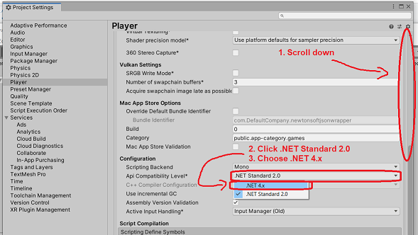

# JSON Unity Wrapper

This project includes a convenient wrapper class for Newtonsoft JSON in Unity3D.

Newtonsoft JSON is my preferred means of handling JSON in Unity. However, setting it up is not straightforward or well documented. I always forget how to do it! So I created this repo, which includes installation instructions and a helpful wrapper class: `JsonWrapper`. 

*Note:* Newtonsoft JSON is quite powerful and flexible. The `JsonWrapper` implementation is the "one size fits all" version that I typically use for save files in my own projects. This class might not be sufficient for more complex tasks.

# Usage

```c#
using SubalternGames;


public class TestObject
{
    public int hp;


    public TestObject(int hp)
    {
        this.hp = hp;
    }


    public void Serialize(string path)
    {
        JsonWrapper.Serialize(this, path);
    }
}
```

### What this can serialize

- Primitives (int, bool, etc.)
- Any struct *including* Vector3, Color, etc.
- Lists, dictionaries, arrays
- Any class that *isn't* a subclass of MonoBehaviour

### What this *can't* serialize

- HashSets, Queues, or Stacks
- Any sub-classes of MonoBehaviour (GameObject, Rigidbody, etc.)

# Installation

### Step 1: Set your Unity project to .NET 4

**Open Project Settings:**


**Open the Player tab and the Other Settings tab:**


**Scroll down and set .NET to 4.x:**



### Step 2: Copy [this file](https://github.com/subalterngames/json_wrapper/raw/main/Assets/Plugins/JSON/Newtonsoft.Json.dll) to `Assets/Plugins/JSON/` in your Unity project

Make sure that the filepath is: `Assets/Plugins/JSON/Newtonsoft.Json.dll`.

In some cases, Unity will log errors in the console about namespace clashes. If you see these errors, you already have Newtonsoft JSON installed as a Unity package; remove `Newtownsoft.Json.dll` from your project.

### Step 3: Copy [this script](https://raw.githubusercontent.com/subalterngames/json_wrapper/main/Assets/Scripts/JsonWrapper.cs) to `Assets/` in your Unity project

The script can be copied anywhere in Assets. For the sake of organizing your project, consider: `Assets/Scripts/SubalternGames/JsonWrapper.cs`

# Example ways to organize your code

Any code that needs to be serialized should be in a "data" class  that is *not* a subclass of MonoBehaviour. I forget how to do this all the time so I'm writing down my two preferred approaches:

### 1.Serialize data by converting MonoBehaviour classes to "data" classes.

This is the best approach if you're adding JSON serialization to your project late in development and it would be too difficult to refactor everything. For every MonoBehaviour class you need to save, create an associated "data" class and add a conversion method:

```c#
using UnityEngine;


public class Monster : MonoBehaviour
{
    public int attack;
    public int hp;


    public MonsterData ToData()
    {
        return new MonsterData(attack, hp);
    }


    public void FromData(MonsterData data)
    {
        attack = data.attack;
        hp = data.hp;
    }
}


/// <summary>
/// Data class for Monster.
/// </summary>
public struct MonsterData
{
    public int attack;
    public int hp;


    public MonsterData(int attack, int hp)
    {
        this.attack = attack;
        this.hp = hp;
    }
}
```

Then, convert from MonoBehaviour to "data" whenever you save or load a game file:

```c#
using SubalternGames;


public class SavedGame
{
    public MonsterData[] monsters;


    public static void Save(string path)
    {
        // Create a new SavedGame.
        SavedGame s = new SavedGame();

        // Convert Monster to MonsterData
        Monster[] monsters = Object.FindObjectsOfType<Monster>();
        s.monsters = new MonsterData[monsters.Length];
        for (int i =0; i < monsters.Length; i++)
        {
            s.monsters[i] = monsters[i].ToData();
        }

        // Serialize to a JSON file.
        JsonWrapper.Serialize(s, path);
    }


    public static void Load(string path)
    {
        SavedGame s = JsonWrapper.DeserializeFromPath<SavedGame>(path);
        // Create Monster objects.
        foreach (MonsterData md in s.monsters)
        {
            GameObject go = new GameObject();
            Monster m = go.AddComponent<Monster>();
            m.FromData(md);
        }
    }
}
```

### 2. Store all serializable data in a separate `GameState`

This requires more forethought than option 1 but can often result in better organization.

Handle *all* of your game logic in "data" classes that propagate actions back to MonoBehaviour classes. This centralizes all of your game logic and can prevent spaghetti code.

This is an `OrcData` class. Note that it has an `onDie`action; it will use this to communicate with the `Orc` class (which we'll define in a moment):

```c#
using System;
using Newtonsoft.Json;


public class OrcData
{
    public int hp = 10;

    // Make sure to include this to prevent it from being serialized.
    [JsonIgnore]
    public Action onDie;
    

    public void Damage(int damage)
    {
        if (hp <= 0)
        {
            return;
        }
        hp -= damage;
        if (hp <= 0)
        {
            hp = 0;
            onDie?.Invoke();
        }
    }
}
```

The `Orc` class has a corresponding `onDamage` action. Note that the `Orc` doesn't action contain its own stats (`hp` in this case).

```c#
using UnityEngine;


public class Orc : MonoBehaviour
{
    public Action onDamage;


    private void OnMouseDown()
    {
        onDamage?.Invoke();
    }
    
    
    public void Kill()
    {
        Destroy(this);
    }
}
```

The `GameState` generates `Orc` objects *from* `OrcData` and links them via action subscription. It serializes *itself* to create a save file.

```c#
using UnityEngine;
using SubalternGames;


public class GameState
{
    public OrcData[] orcData;


    /// <summary>
    /// Singleton instance.
    /// </summary>
    private static GameState instance;


    public static void NewGame()
    {
        instance = new GameState();
        instance.orcData = new OrcData[5];

        // Create some orcs.
        for (int i = 0; i < 5; i++)
        {
            instance.orcData[i] = new OrcData();
        }

        instance.Initialize();
    }


    public static void Load(string path)
    {
        instance = JsonWrapper.DeserializeFromPath<GameState>(path);
        instance.Initialize();
    }


    public static void Save(string path)
    {
        JsonWrapper.Serialize(instance, path);
    }


    private void Initialize()
    {
        // Generate some orcs.
        foreach (OrcData orcData in instance.orcData)
        {
            GameObject go = new GameObject();
            Orc o = go.AddComponent<Orc>();

            // When the orc is damaged, subtract HP.
            o.onDamage += orcData.Damage;
            // When the orc dies, destroy it.
            orcData.onDie += o.Kill;
        }
    }
}
```

# API

### `Serialize<T>(T o, string path)`

Serialize an object of type `T` to a file.

| Parameter | Type     | Description                                                  |
| --------- | -------- | ------------------------------------------------------------ |
| `o`       | `T`      | The object.                                                  |
| `path`    | `string` | The absolute path to the file (including the file extension). |

```c#
using SubalternGames;


public class TestObject
{
    public int hp;


    public TestObject(int hp)
    {
        this.hp = hp;
    }


    public void Serialize(string path)
    {
        JsonWrapper.Serialize(this, path);
    }
}
```

***

### `Deserialize<T>(string o)`

Deserialize a serialized object of type `T`.

*Return:* An object of type `T`.

| Parameter | Type | Description            |
| --------- | ---- | ---------------------- |
| `o`       | `T`  | The serialized object. |

```c#
using SubalternGames;


public class TestObject
{
    public int hp;


    public TestObject(int hp)
    {
        this.hp = hp;
    }


    public static TestObject Deserialize(string serialized)
    {
        return JsonWrapper.Deserialize<TestObject>(serialized);
    }
}
```

***

### `DeserializeFromPath<T>(string path)`

Deserialize an object of type `T` stored as a text file.

*Return:* An object of type `T`.

| Parameter | Type     | Description                                                  |
| --------- | -------- | ------------------------------------------------------------ |
| `path`    | `string` | The absolute path to the text file (including the file extension). |

```c#
using SubalternGames;


public class TestObject
{
    public int hp;


    public TestObject(int hp)
    {
        this.hp = hp;
    }


    public static TestObject DeserializeFromPath(string path)
    {
        return JsonWrapper.DeserializeFromPath<TestObject>(path);
    }
}
```

***

### `DeserializeFromResources<T>(string path)`

Deserialize an object of type T stored as a text file in Resources.

*Return:* An object of type `T`.

| Parameter | Type     | Description                                                  |
| --------- | -------- | ------------------------------------------------------------ |
| `path`    | `string` | The path to the file in Resources (*minus* the file extension). |

```c#
using SubalternGames;


public class TestObject
{
    public int hp;


    public TestObject(int hp)
    {
        this.hp = hp;
    }


    public static TestObject DeserializeFromResources(string path)
    {
        return JsonWrapper.DeserializeFromResources<TestObject>(path);
    }
}
```

