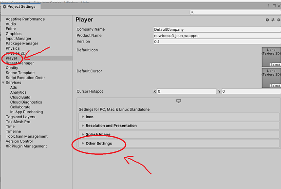

# JSON Unity Wrapper

This project includes a convenient wrapper class for Newtonsoft JSON in Unity3D.

Newtonsoft JSON is my preferred means of handling JSON in Unity. However, setting it up is not straightforward or well documented. I always forget how to do it! So I created this repo, which includes installation instructions and a helpful wrapper class: `JsonWrapper`. 

*Note:* Newtonsoft JSON is quite powerful and flexible. The `JsonWrapper` implementation is the "one size fits all" version that I typically use for save files in my own projects. This class might not be sufficient for more complex tasks.

## Example usage

```c#
using SubalternGames;


public class TestObject
{
    public int hp;


    public TestObject(int hp)
    {
        this.hp = hp;
    }


    public void Serialize(string path)
    {
        JsonWrapper.Serialize(this, path);
    }
}
```

## Installation

### Step 1: Set your Unity project to .NET 4

**Open Project Settings:**


**Open the Player tab and the Other Settings tab:**



**Scroll down and set .NET to 4.x:**


### Step 2: Copy [this file](https://github.com/subalterngames/json_wrapper/raw/main/Assets/Plugins/JSON/Newtonsoft.Json.dll) to `Assets/Plugins/JSON/` in your Unity project

Make sure that the filepath is: `Assets/Plugins/JSON/Newtonsoft.Json.dll`.

In some cases, Unity will log errors in the console about namespace clashes. If you see these errors, you already have Newtonsoft JSON installed as a Unity package; remove `Newtownsoft.Json.dll` from your project.

### Step 3: Copy [this script](https://raw.githubusercontent.com/subalterngames/json_wrapper/main/Assets/Scripts/JsonWrapper.cs) to `Assets/` in your Unity project

The script can be copied anywhere in Assets. For the sake of organizing your project, consider: `Assets/Scripts/SubalternGames/JsonWrapper.cs`

## API

### `Serialize<T>(T o, string path)`

Serialize an object of type `T` to a file.

| Parameter | Type     | Description                                                  |
| --------- | -------- | ------------------------------------------------------------ |
| `o`       | `T`      | The object.                                                  |
| `path`    | `string` | The absolute path to the file (including the file extension). |

```c#
using SubalternGames;


public class TestObject
{
    public int hp;


    public TestObject(int hp)
    {
        this.hp = hp;
    }


    public void Serialize(string path)
    {
        JsonWrapper.Serialize(this, path);
    }
}
```

***

### `Deserialize<T>(string o)`

Deserialize a serialized object of type `T`.

*Return:* An object of type `T`.

| Parameter | Type | Description            |
| --------- | ---- | ---------------------- |
| `o`       | `T`  | The serialized object. |

```c#
using SubalternGames;


public class TestObject
{
    public int hp;


    public TestObject(int hp)
    {
        this.hp = hp;
    }


    public static TestObject Deserialize(string serialized)
    {
        return JsonWrapper.Deserialize<TestObject>(serialized);
    }
}
```

***

### `DeserializeFromPath<T>(string path)`

Deserialize an object of type `T` stored as a text file.

*Return:* An object of type `T`.

| Parameter | Type     | Description                                                  |
| --------- | -------- | ------------------------------------------------------------ |
| `path`    | `string` | The absolute path to the text file (including the file extension). |

```c#
using SubalternGames;


public class TestObject
{
    public int hp;


    public TestObject(int hp)
    {
        this.hp = hp;
    }


    public static TestObject DeserializeFromPath(string path)
    {
        return JsonWrapper.DeserializeFromPath<TestObject>(path);
    }
}
```

***

### `DeserializeFromResources<T>(string path)`

Deserialize an object of type T stored as a text file in Resources.

*Return:* An object of type `T`.

| Parameter | Type     | Description                                                  |
| --------- | -------- | ------------------------------------------------------------ |
| `path`    | `string` | The path to the file in Resources (*minus* the file extension). |

```c#
using SubalternGames;


public class TestObject
{
    public int hp;


    public TestObject(int hp)
    {
        this.hp = hp;
    }


    public static TestObject DeserializeFromResources(string path)
    {
        return JsonWrapper.DeserializeFromResources<TestObject>(path);
    }
}
```

